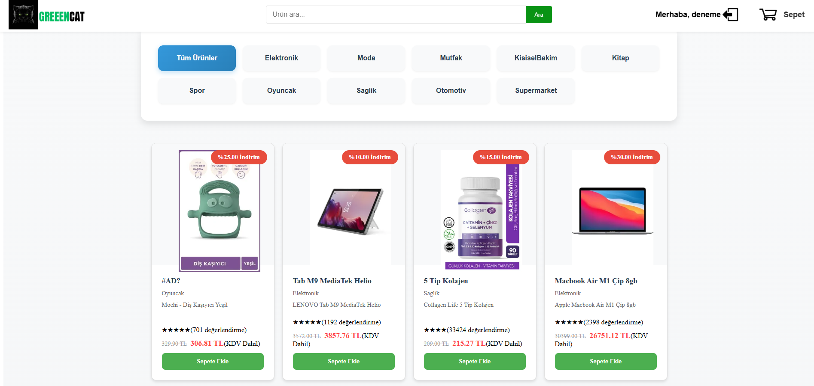

# E-Commerce Website - Greencat

## Overview

The **E-Commerce Website - Greencat** project was developed by Ali Riza Ercan for the Database Management Systems course during the 2024-2025 Fall Semester at KTO Karatay University. This project presents an e-commerce platform with a user-friendly frontend and a detailed backend. Users can interact with various sections of the website, allowing them to purchase products from GreenCat. The platform provides features such as viewing product details, managing a shopping cart, placing orders, adding shipping addresses, and completing payments. Users can also review past and current order details and update their profile information. The website offers product browsing based on selected categories, and users can add items to their shopping carts.

The **E-Commerce Website - Greencat** aims to build a comprehensive platform for users to view, analyze, and interact with products in an e-commerce setting. This project integrates data engineering, data science techniques, and a robust database management system to process, store, and analyze e-commerce data. Users can access data-driven insights, such as sales trends, product demand, and customer behavior.

This project was created for the **Database Management Systems** course, focusing on advanced database management techniques, backend development with Flask, and frontend development using ReactJS.



## Project Objective

The goal of this project is to develop an accessible and interactive platform for e-commerce websites that facilitates the collection, analysis, and presentation of data. It features data processing, visualization, and ecommerce functionalities, while also offering user interactivity. Feedback collection will be integrated to continuously improve the platform.

## Technologies Used

- **Programming Language**: Python
- **Database Management**: PostgreSQL
- **Web Framework**: Flask (Backend), ReactJS (Frontend)
- **Data Analysis Libraries**: Pandas, NumPy, scikit-learn
- **Web Scraping Libraries**: BeautifulSoup, Selenium
- **Data Visualization**: Matplotlib, Seaborn, Plotly, Dash
- **Frontend Technologies**: HTML, CSS, JavaScript, ReactJS
- **Other Tools**: Bootstrap/Tailwind CSS (for UI design)

## Project Content and Structure

### 1. Data Collection

- **Data Sources**: Datasets are scraped from Trendyol and other e-commerce platforms.
  
- **Manual Data Collection**: Information such as product details, prices, stock status, categories, and user reviews are manually gathered from e-commerce websites.

### 2. Data Processing and Cleaning

- **Data Processing with Python**: The data is cleaned and organized using Python libraries such as Pandas and NumPy. Tasks include handling missing values, detecting anomalies, and converting data types.
  
- **Data Visualization**: Visualization tools like Matplotlib and Seaborn are used to create graphs for sales trends, user review distributions, and product-specific performance.

### 3. Database Management and Storage

- **Database Utilization**: Data is stored in a PostgreSQL database, with structured tables for product information, sales data, and user reviews.
  
- **Data Modeling**: The database schema includes tables for products, sales, users, and reviews, enabling efficient querying and reporting.

### 4. Reporting and Visualization

- **Dashboard Creation**: An interactive dashboard is built to present sales data, forecasts, and performance analytics.
  
- **Visualization Tools**: Interactive graphs using Plotly or Dash provide users with the ability to filter and interact with the data.

### 5. Web Application Development

- **Frontend Development**: The frontend is built using ReactJS, with UI design supported by frameworks like Bootstrap or Tailwind CSS.
  
- **Backend Development**: The backend is developed using Flask to handle data processing, analysis, and user requests.

- **User Interaction**: Users can create accounts, log in, and access their personal data. Feedback forms are also integrated to allow for continuous platform improvement.

### 6. Automation and OOP Structure

- **OOP Principles**: The codebase is structured using Object-Oriented Programming (OOP) principles to ensure modularity, reusability, and maintainability.
  
- **Automatic Reporting**: Automation is achieved through cron jobs or Python bots to update data and generate reports at specified intervals.

## Features

- **Responsive E-commerce Website**: Users can browse products, view details, and make purchases.
- **Interactive Dashboard**: A user-friendly dashboard displaying real-time data and analytics. Admin panel includes visual graphs and insights.

## Getting Started

To get started with the project, follow these instructions:

### Prerequisites

- **Python 3.x** installed
- **PostgreSQL** database setup
- **Node.js** and **npm** for ReactJS

### Installation

1. Clone the repository:

```bash
   git clone <https://github.com/alirizaercan/eCommerce_Website_Greencat.git>
   cd eCommerce_Website_Greencat
```

2. Install Python dependencies:

```bash
    pip install -r backend/requirements.txt
```

3. Set up the PostgreSQL database:

 - Create the necessary tables using the provided SQL schema files.
 - Populate the tables with sample or live data. You may need to update the `DATABASE_URL` in your environment or configuration file to match your database setup.

4. Install frontend dependencies:

```bash
    cd frontend
    npm install
```

5. Start the backend Flask server in new terminal:

```bash
cd backend
python app/run.py
```

6. Start the frontend ReactJS application:

```bash
cd frontend
npm start
```

Visit `http://localhost:3000` to access the application.

### Contributing
Feel free to fork the repository, submit issues, or contribute enhancements and bug fixes. If you have any questions or suggestions, please open an issue or create a pull request.

### License
This project is licensed under the MIT License - see the LICENSE file for details.

### Acknowledgments
- Thanks to the contributors of Flask, ReactJS, PostgreSQL, and the Python data science libraries.